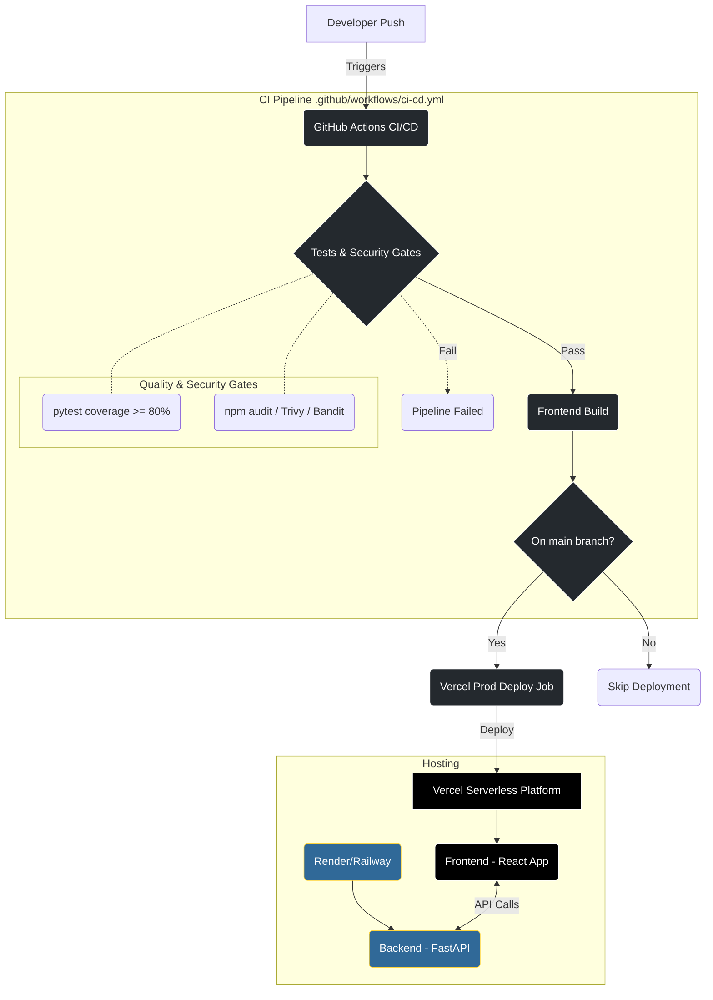

# Deployment and Operations Guide

This document contains the deployment architecture, runbook, and instructions for configuring the CI/CD pipeline for the project.

## 1. Architecture Diagram



## 2. Setting Up GitHub Secrets

To allow GitHub Actions to securely deploy the application to Vercel, you need to configure specific secrets in your GitHub repository.

### Prerequisites (Obtaining Vercel Tokens)
1. **VERCEL_TOKEN**: Go to your Vercel Account Settings -> Tokens -> Create a new token.
2. **VERCEL_ORG_ID** & **VERCEL_PROJECT_ID**: 
   - Install Vercel CLI locally (`npm i -g vercel`).
   - Run `vercel link` in your `frontend/` directory and follow the prompts.
   - This will create a `.vercel/project.json` file.
   - Open `.vercel/project.json` to find `orgId` (which is `VERCEL_ORG_ID`) and `projectId` (which is `VERCEL_PROJECT_ID`).

### Adding to GitHub
1. Navigate to your GitHub Repository -> **Settings** tab.
2. In the left sidebar, click on **Secrets and variables** -> **Actions**.
3. Click the **New repository secret** button.
4. Add the following secrets:
   - Name: `VERCEL_TOKEN`, Value: `<Your token>`
   - Name: `VERCEL_ORG_ID`, Value: `<Your orgId>`
   - Name: `VERCEL_PROJECT_ID`, Value: `<Your projectId>`

## 3. Operations Runbook

### Handling Pipeline Failures

**1. Coverage Threshold Failed**
- **Symptom:** The pipeline fails at `Run Backend Tests with Coverage Quality Gate`.
- **Action:** Check the test coverage output in GitHub Actions logs. You must ensure Python backend tests cover >= 80% of statements.
- **Resolution:** Run `pytest --cov=.` locally. Add missing unit tests for untested files and push again.

**2. Security Vulnerabilities Detected**
- **Symptom:** Pipeline fails at `Frontend Security Scanning (npm audit)` or `Security Scanning (Trivy)`.
- **Action:**
  - For Node.js (npm audit): Review the packages with vulnerabilities. Run `npm config set audit-level critical` and `npm audit fix` locally.
  - For Python (Bandit): Review the offending code lines matching the output and refactor.
- **Resolution:** Update dependencies or code logic to remediate the vulnerability, then commit changes.

**3. Deployment Failures (Vercel)**
- **Symptom:** `Deploy Project to Vercel` job fails.
- **Action:** 
  - Ensure the GitHub Secrets (`VERCEL_TOKEN`, `VERCEL_ORG_ID`, `VERCEL_PROJECT_ID`) are correctly configured and have not expired.
  - Check Vercel logs in the Vercel Dashboard for any build compilation errors that only occurred in the Vercel environment.
- **Resolution:** Update the secret values or fix Vercel specific build issues.

### Manual Deployment
If CI/CD is down, you can manually deploy using your local machine:
```bash
cd frontend
vercel build --prod
vercel deploy --prebuilt --prod
```
