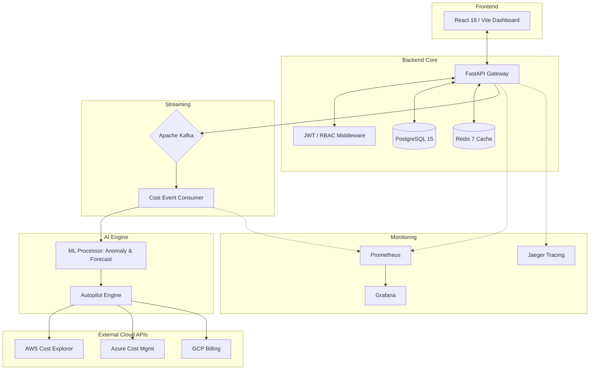
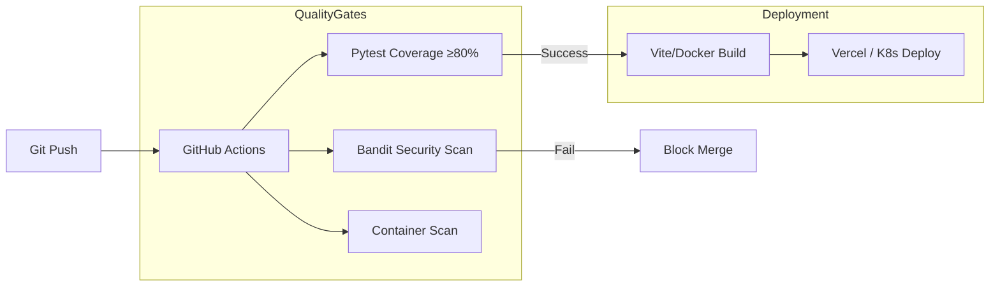

<p align="center">
  
</p>

<p align="center">
  <a href="https://ai-cloud-cost-optimizer.vercel.app">
    
  </a>
  
  
  
  
  
  
  
</p>

<p align="center">
  
  
  
</p>

<h3 align="center">
  "Stop wasting cloud budget. Let AI identify, forecast, and fix it — automatically."
</h3>

<p align="center">
  <a href="https://ai-cloud-cost-optimizer.vercel.app">
    
  </a>
  <a href="DEPLOYMENT.md">
    
  </a>
  <a href="https://github.com/ummadisettycharansai/ai-cloud-cost-optimizer">
    
  </a>
</p>

---

## 📑 Table of Contents

- [Project Overview](#-project-overview)
- [Key Features](#-key-features)
- [Architecture Diagram](#-architecture-diagram)
- [Deployment Architecture](#-deployment-architecture)
- [Project Folder Structure](#-project-folder-structure)
- [Tech Stack](#-tech-stack)
- [Screenshots](#-screenshots)
- [Quick Start (Docker)](#-quick-start-docker)
- [Local Development](#-local-development)
- [Deployment Guide](#-deployment-guide)
- [CI/CD Pipeline](#-cicd-pipeline)
- [Contributing Guide](#-contributing-guide)
- [License](#-license)

---

## 🧐 Project Overview

In a world governed by multi-cloud complexity, organizations often bleed revenue through **idle resources, over-provisioned VMs, and forgotten storage assets**. Traditional cost management units are retroactive and manual, failing to keep pace with dynamic container orchestration and serverless scaling.

**AI Cloud Cost Optimizer** is an enterprise-grade, event-driven FinOps platform designed to bridge the gap between visibility and action. It combines real-time data ingestion with advanced AI logic to perform three critical functions:

1.  **Anomaly Detection**: Identifies billing spikes in near real-time using statistical Z-Score modeling.
2.  **Spend Forecasting**: Projects future costs using polynomial regression with high-confidence intervals.
3.  **Autonomous Remediation (Cost Autopilot)**: Executes rightsizing and lifecycle actions automatically based on user-defined safety policies.

By providing a unified pane of glass for AWS, Azure, and GCP, this platform empowers FinOps teams to transition from "paying for what you provision" to "paying for what you use."

---

## ✨ Key Features

<table width="100%">
  <tr>
    <td width="50%">
      <b>🌐 Multi-Cloud Integration</b><br/>
      Connects AWS, Azure, and GCP through a unified interface. Uses Fernet symmetric encryption to secure cloud credentials in the primary database. <i>Benefit: Eliminates multi-provider visibility silos with enterprise security.</i>
    </td>
    <td width="50%">
      <b>🧠 AI Cost Anomaly Detection</b><br/>
      Leverages Z-Score statistical modeling to detect billing anomalies within hours of ingestion. Calibrated per-service to minimize false alerts. <i>Benefit: Prevents runaway costs from misconfigured services or sudden traffic spikes.</i>
    </td>
  </tr>
  <tr>
    <td>
      <b>📈 Predictive Cost Forecasting</b><br/>
      Employs polynomial regression on 30-day trailing spend to project future usage trends with confidence bounds. <i>Benefit: Enables proactive budget planning rather than reactive end-of-month reporting.</i>
    </td>
    <td>
      <b>🤖 Cost Autopilot</b><br/>
      Autonomous remediation engine that executes rightsizing, Spot migrations, and orphaned disk deletions via Cloud SDKs. <i>Benefit: Reduces manual DevOps toil by fixing waste automatically under predefined safety levels.</i>
    </td>
  </tr>
  <tr>
    <td>
      <b>💰 Budget Engine</b><br/>
      Real-time org-level spend tracking with configurable multi-stage alert thresholds. Updates dynamically as Kafka billing events stream in. <i>Benefit: Ensures absolute adherence to financial guardrails across complex org structures.</i>
    </td>
    <td>
      <b>📋 Recommendation Matrix</b><br/>
      Scans cloud inventory for Spot migration opportunities, S3 tiering, and VM rightsizing. Assigns ROI scores and priority tiers. <i>Benefit: Provides a prioritized backlog of high-impact cost-saving actions for platform engineers.</i>
    </td>
  </tr>
  <tr>
    <td>
      <b>🔐 Multi-Tenant RBAC</b><br/>
      Hierarchical organization, project, and account structure with Admin, Finance, and Viewer roles. Enforces absolute row-level data isolation. <i>Benefit: Securely supports large enterprises with segregated business units and access needs.</i>
    </td>
    <td>
      <b>📡 Full Observability Stack</b><br/>
      Integrated Prometheus metrics, Grafana dashboards, and Jaeger distributed tracing. <i>Benefit: Monitors everything from API latency to Kafka consumer lag and ML inference performance in one place.</i>
    </td>
  </tr>
</table>

---

## 🏗 Architecture Diagram



---

## 🚀 Deployment Architecture

### Production Environment
```text
Vercel (React SPA) ─► Render/Railway (FastAPI) ─► Managed PostgreSQL/Redis
                                    │
                                    └─► K8s Cluster (EKS/AKS/GKE)
                                          ├─ Kafka + Zookeeper
                                          ├─ Celery Workers
                                          └─ Cost Event Consumer
```

### Development Environment (Local)
```text
docker-compose up ─► Localhost Swarm
                      ├─ Frontend (Port 5173)
                      ├─ Backend (Port 8000)
                      ├─ Kafka + Zookeeper
                      └─ Postgres + Redis + Prometheus + Grafana
```

---

## 📂 Project Folder Structure

```text
ai-cloud-cost-optimizer/
├── .github/workflows/       # GitHub Actions CI/CD pipelines (Backend & Main)
├── backend/                 # FastAPI Core Application
│   ├── auth/                # JWT Authentication & RBAC logic
│   ├── models/              # SQLAlchemy ORM models (Database Schema)
│   ├── services/            # Business logic (Cloud connector, recommendation engine)
│   ├── workers/             # Celery async task definitions
│   ├── ml_pipeline/         # AI/ML logic (Anomaly & Forecasting)
│   ├── cloud_integrations/  # Provider-specific API wrappers (AWS/GCP/Azure)
│   └── main.py              # Application entrypoint & Router registration
├── frontend/                # React 18 + Vite SPA
│   ├── src/components/      # Reusable UI components (Modals, Buttons)
│   ├── src/pages/           # Dashboard, Autopilot, and Settings pages
│   ├── src/charts/          # Cost analytics & forecasting visualizations
│   └── src/utils/           # API client and formatting helpers
├── streaming/               # Real-time event processing
│   └── kafka_consumer/      # High-concurrency cost event consumer
├── infrastructure/          # Cloud-native infrastructure configs
│   └── kubernetes/          # K8s YAML manifests for cluster deployment
├── obs/                     # Observability configuration
│   ├── prometheus.yml       # Metrics scraping targets
│   └── grafana/             # Pre-configured dashboard JSONs
├── docs/                    # Architecture diagrams and system assets
├── docker-compose.yml       # Multi-service local development stack
├── docker-compose.obs.yml   # Observability & Monitoring stack extension
├── railway.toml             # Configuration for Railway.app deployments
└── render.yaml              # Configuration for Render.com deployments
```

---

## 🛠 Tech Stack

| Layer | Technology | Version | Purpose |
| :--- | :--- | :--- | :--- |
| **Frontend** | React 18 / Vite | TypeScript | High-performance Analytics UI |
| **Backend** | FastAPI | Python 3.12+ | Asynchronous REST API Gateway |
| **AI / ML** | scikit-learn / PolyFit | — | Anomaly Detection & Forecasting |
| **Primary DB** | PostgreSQL | 15 | Multi-tenant Persistence |
| **Cache / MQ** | Redis | 7 | Speed layer & Task coordination |
| **Streaming** | Apache Kafka | 3.x | Real-time Billing Event Pipeline |
| **Security** | Fernet / JWT | HS256 | Credential Encryption & Auth |
| **Cloud APIs** | AWS / Azure / GCP | SDKs | Native Provider Integrations |
| **Orchestration** | Kubernetes | EKS/AKS | Production Cluster Management |
| **Observability** | Prometheus/Grafana | OSS | Metrics & Performance Dashboards |
| **E2E Testing** | Playwright | — | Frontend User Flow Validation |
| **SAST** | Bandit / Trivy | — | Security & Container Scanning |

---

## 📸 Screenshots

| Dashboard Overview | Cost Autopilot UI |
| :---: | :---: |
|  |  |
| **AI Forecasts** | **Budget Configurator** | Cloud Hub |
|  |  |  |

---

## 🐳 Quick Start (Docker)

**Prerequisites**: Docker Engine 24+, Docker Compose v2+

1. **Clone the repository**
   ```bash
   git clone https://github.com/ummadisettycharansai/ai-cloud-cost-optimizer.git
   cd ai-cloud-cost-optimizer
   ```

2. **Initialize Environment**
   ```bash
   cp backend/.env.example backend/.env
   # Update the .env file with your cloud credentials if testing real integrations
   ```

3. **Launch Stack**
   ```bash
   docker-compose up --build
   ```

| Service | URL | Notes |
| :--- | :--- | :--- |
| **React Dashboard** | http://localhost:5173 | UI for registration and management |
| **FastAPI Swagger** | http://localhost:8000/docs | Interactive API documentation |
| **Grafana** | http://localhost:3000 | User: `admin` / Pass: `finops` |
| **Prometheus** | http://localhost:9090 | Metric exploration UI |
| **Jaeger UI** | http://localhost:16686 | Distributed tracing dashboard |

---

## 💻 Local Development

### Backend Setup
```bash
cd backend
python -m venv venv
# Windows: venv\Scripts\activate | Unix: source venv/bin/activate
pip install -r requirements.txt
uvicorn main:app --reload --host 127.0.0.1 --port 8000
```

### Frontend Setup
```bash
cd frontend
npm install
npm run dev
```

### Running Tests
```bash
# Backend unit tests & coverage
cd backend
pytest --cov=. --cov-report=term-missing --cov-fail-under=80

# Frontend E2E tests
cd frontend
npx playwright test
```

---

## ☸️ Deployment Guide

### A) Docker Compose (Full Stack)
Recommended for staging and single-node evaluation.
```bash
docker-compose -f docker-compose.yml -f docker-compose.obs.yml up -d
```

### B) Kubernetes
Production deployment via EKS/AKS.
```bash
kubectl apply -f infrastructure/kubernetes/
kubectl get pods -l app=finops-backend
kubectl get svc finops-ingress
```

### C) Cloud Platforms
- **Frontend**: Connect to Vercel and point to `frontend/` folder.
- **Backend**: Connect to Render/Railway and point to `backend/` folder.

---

## 🔄 CI/CD Pipeline



### Required Secrets
| Secret | How to Obtain |
| :--- | :--- |
| `VERCEL_TOKEN` | Vercel Account Settings → Tokens |
| `VERCEL_ORG_ID` | `vercel link` → `.vercel/project.json` → `orgId` |
| `VERCEL_PROJECT_ID` | `vercel link` → `.vercel/project.json` → `projectId` |

---

## 🤝 Contributing Guide

### Branching Model
| Prefix | Purpose |
| :--- | :--- |
| `feature/` | New functionality or dashboard components |
| `fix/` | Bug fixes and remediation logic patching |
| `chore/` | CI/CD changes, dependencies, or refactors |
| `docs/` | Documentation and architecture updates |

### PR Requirements
- All CI checks must pass (Test coverage ≥80% is enforced).
- Mandatory security scans (Bandit/Trivy) must come back clean.
- At least one code review approval from a project maintainer.

---

## 📜 License

This project is licensed under the **MIT License** - see the [LICENSE](LICENSE) file for details.

---

<p align="center">
  
</p>

<p align="center">
  Built with ❤️ by <a href="https://github.com/ummadisettycharansai">Charan Sai</a><br/>
  <b>⭐ Star this repo if it helped your FinOps journey!</b>
</p>
